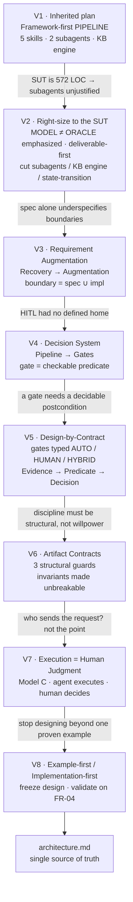
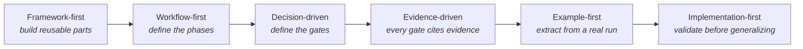
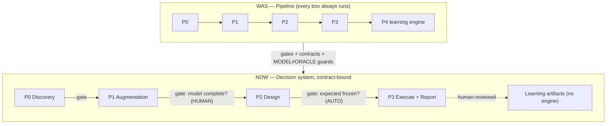
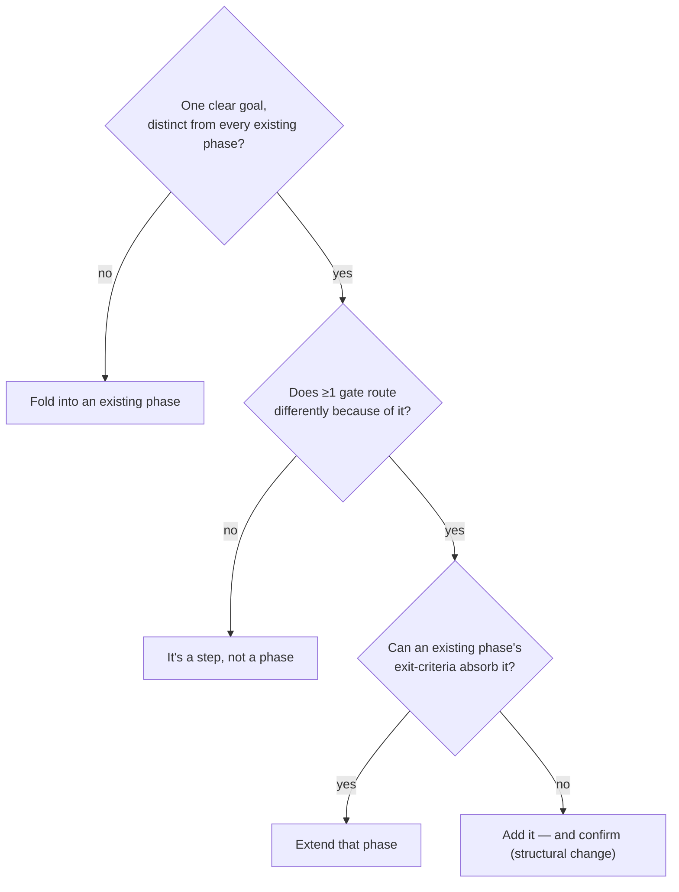
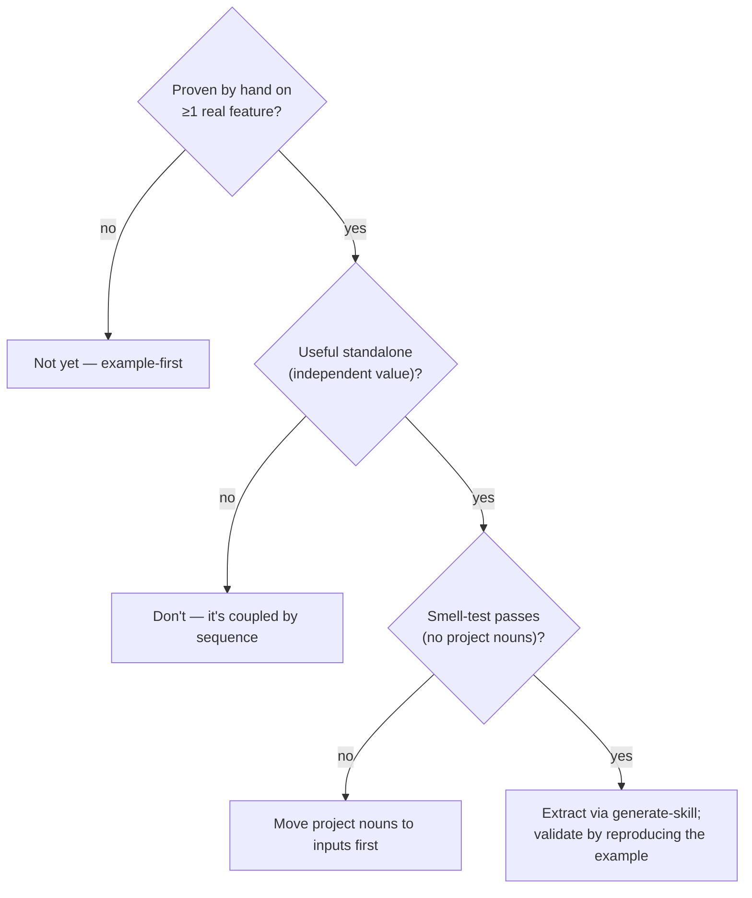
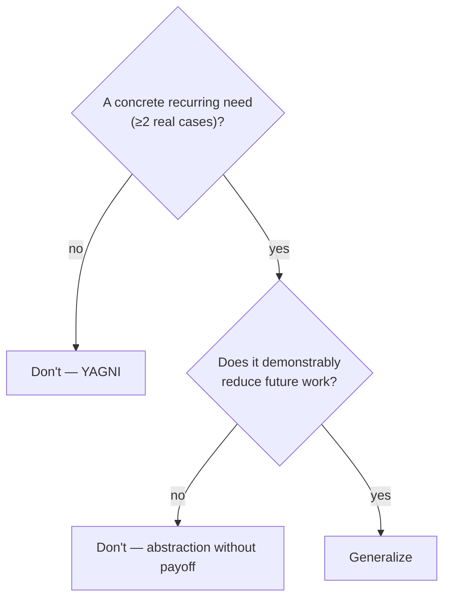
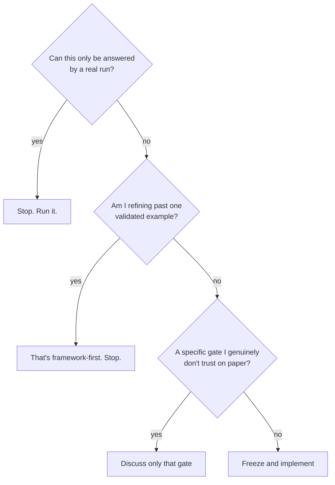

# design-evolution.md — How the Architecture Was Reasoned Into Existence

> **Read this to remember *why*, not *what*.** The frozen *what* lives in `architecture.md`.
> This document records the *evolution* — the wrong turns, the corrections, and the reasoning —
> so a cold reader (including future-you) recovers the whole thinking process in < 10 minutes,
> or < 5 from the cheat sheet (§8). Nothing here is new design; it only documents frozen decisions.

---

## 1. Executive Summary (one page)

**Why this diagram:** the entire project reasoning, as one spine. Each node is a version; each
edge is the single force that pushed to the next.



**One-line takeaway:** we moved from *building a framework* to *proving a method*, and from a
*pipeline you run* to a *decision system you defend*.

---

## 2. Evolution Timeline (comparison tables)

**Why tables:** each version is a swap — old solution out, new solution in. A table shows the
swap and its trigger without prose.

| Ver | Previous solution | New solution | Why the old failed | New mindset |
|----|----|----|----|----|
| **V1→V2** | 5 skills + 2 subagents + 5-file KB engine, build-all-then-pilot | 2 core skills, no subagents, learning *artifacts* only, deliverable-first | Subagent rationale ("reads lots of code") false for a 572-LOC SUT; KB engine grades 0; build order validates the toolchain only at the end | Right-size to the SUT; spend tokens on output, not scaffolding |
| **V2→V3** | Phase 1 = "Spec Recovery from code" | Phase 1 = "Requirement **Augmentation**": spec × impl | "Recovery" implies no spec; spec exists and is authoritative. Boundaries from code alone miss "code forgot X" bugs | Boundary = **union(spec, impl)**; code enriches the *model*, never the *oracle* |
| **V3→V4** | Linear pipeline (every stage always runs) | Decision system (each phase exits through a gate) | A pipeline has no place for human judgment and no way to skip inapplicable work | A phase is defined by its **exit condition**, not its activity |
| **V4→V5** | Gates as vague checkpoints | Gates typed AUTO / HUMAN / HYBRID with a *checkable* predicate | "Requirement complete?" is undecidable as written → a fake gate | Judgment points = explicit questions; mechanical points = one-liners |
| **V5→V6** | "Be disciplined about MODEL ≠ ORACLE" | 3 **structural guards** in the artifact contracts | Discipline drifts under an LLM that sees the actual response | Make the violation **unrepresentable**, not merely discouraged |
| **V6→V7** | Human executes every request | Model C: agent executes, human judges | HW requires *review*, not execution; human-as-executor is weak AI-first and slow | HITL belongs at the **decision**, not the I/O |
| **V7→V8** | Keep refining the decision graph | Freeze; validate on the first pilot feature | Refining past one validated example is the framework-first trap we rejected | Stop designing when only a real run can answer the question |

---

## 3. Mindset Evolution

**Why this chain:** the architecture changed because the *lens* changed. Same facts, better question each time.



| Transition | Why it happened |
|---|---|
| Framework → Workflow | Reusable parts had no proven shape to be reusable *of*. Define the flow first. |
| Workflow → Decision | A flow with no branch points can't host judgment or skip inapplicable steps. |
| Decision → Evidence | A gate is only trustworthy if its input is a concrete pointer (spec line, response, screenshot). |
| Evidence → Example | You can't write a correct gate predicate or contract field from imagination; a real run reveals it. |
| Example → Implementation | Generalizing from one example is fine; *designing further* before running it is not. |

---

## 4. Architecture Evolution (before / after)

**Why one merged diagram:** the structural change is a *shape* change — from a straight line to a
gated graph to a contract-bound system. Seeing the shapes side by side is the whole point.



**What structurally changed (not the phase count — the phase *nature*):**

| Aspect | Pipeline (was) | Decision system (now) |
|---|---|---|
| A phase is… | a set of activities | a contract with an exit predicate |
| Between phases | an arrow | a typed gate (AUTO/HUMAN/HYBRID) |
| Data between phases | informal | 6 **artifact contracts** with IDs |
| MODEL ≠ ORACLE | a slogan | 3 structural guards (unrepresentable to violate) |
| Learning | self-updating engine | human-reviewed artifacts only |
| Execution | human runs requests | agent runs, human judges (Model C) |

---

## 5. Decision History (replaces reading the chat)

**Why this table:** if you read only one section, read this. Every load-bearing decision, why the
alternative lost, and what it bought.

| # | Decision | Alternatives | Why rejected | Final choice | Evidence / trigger | Result |
|---|---|---|---|---|---|---|
| 1 | Subagents | 2 (sre-analyst, test-executor) | "heavy context" false for tiny SUT | None; run in main | `server.js` = 572 LOC | Less orchestration, easier debug |
| 2 | Skill count | 5 phase-shaped skills | Over-decomposition; premature | 2 core + `build-test-model` may merge | Independent-value test | Fewer validation targets |
| 3 | Build order | Build all skills → pilot | Validates toolchain only at the end | Deliverable-first; extract skills after FR-04 | User's own example-first principle | Risk front-loaded |
| 4 | Phase 1 identity | Spec Recovery from code | Spec exists & authoritative; mislabels | Requirement Augmentation (spec × impl) | Phone: spec gives 1 boundary, code gives 4 | Richer model, clean oracle |
| 5 | Feature Discovery | Skill now / cut to checklist | 1 repo → overfit; checklist → loses seam | Keep as phase; defer skill to 2nd repo | Only one repo available | Abstraction kept, not over-built |
| 6 | Learning | 5-file KB + engine | 0 graded deliverables; self-learning out of scope | Artifacts that feed deliverables; defer engine | Rubric §14 has no KB | Less machinery |
| 7 | State Transition | Include as a default technique | No home in the 4 features (order SM out of scope) | Excluded (dead gate) | Feature set has no state machine | No manufactured tests |
| 8 | Workflow model | Linear pipeline | No home for HITL; can't skip work | Decision system (gates) | "requirement complete?" undecidable | HITL located at gates |
| 9 | Gate types | AUTO / HUMAN only | Misses confidence-threshold routing | + HYBRID (threshold) | Confidence should change routing | Confidence becomes functional |
| 10 | Gate storage | Separate `gates.md` | Two sources of truth → sync drift | Exit-criteria in SKILL; handoff in Command | A skill naming "Phase 2" breaks reuse | No drift; reuse protected |
| 11 | Metadata fields | {source, confidence, reviewed, status} | `reviewed` ⊂ `status` | {source, confidence, status} | Overlap analysis | Minimal; unified w/ assumptions |
| 12 | Execution medium | Node harness / browser | Harness = ungraded automation + PS-curl pain; browser can't reach hidden fields | `.http` API client + browser for UI/screenshots | FR-08 total & FR-04 role invisible in UI | Minimal infra; reaches bugs |
| 13 | Execution control | Model A (human runs) / B (human clicks) | A over-serves + weak AI-first; B click = ceremony | Model C (agent runs, human judges) | Claude Code native Bash builds nothing | Max AI-first; HITL at decision |
| 14 | Assertions | In the execution tool | Contamination + becomes a framework | In workflow / human review | Tool must not be the oracle | Tool stays dumb |
| 15 | Missing abstraction | None / JSON schemas | Integration ambiguity; schemas ≠ interfaces | Artifact Contracts + 3 structural guards | Exec-result with no `expected` field | Invariants structural |
| 16 | Smoke target | FR-04 / pre-built templates | FR-04 outcome less certain; templates speculative | FR-08 forged `total_amount` as vertical smoke | Two spec docs *explicitly* contradict | Pipeline isolated from design |
| 17 | Source of truth | Keep master-plan / HTML | They describe the superseded architecture | New `architecture.md` owns; others reference | Drift review | One authoritative doc |

---

## 6. Major Turning Points

**Why callouts:** these seven moments each introduced an *invariant* — a rule that never bends
again. Everything after them is downstream.

> **① MODEL ≠ ORACLE — principle → structurally enforced**
> - **Trigger:** the SUT has *intentional* bugs; deriving "expected" from code would confirm bugs as correct.
> - **Why necessary:** an LLM that sees the actual response will backfill "expected" to match.
> - **New invariant:** expected comes only from spec/accepted-assumption; enforced by 3 structural guards.

> **② Recovery → Requirement Augmentation**
> - **Trigger:** the phone example — spec gives one boundary, the code's regex/trim/maxlength give more.
> - **Why necessary:** spec-only boundaries miss branch edges; code-only boundaries miss omissions.
> - **New invariant:** boundary = **union(spec, impl)**, each tagged with provenance.

> **③ Pipeline → Decision System**
> - **Trigger:** "where does Human-in-the-Loop actually go?" had no answer in a straight line.
> - **Why necessary:** a workflow must skip inapplicable work and place judgment explicitly.
> - **New invariant:** every phase exits through a **checkable gate**; an uncheckable predicate is not a gate.

> **④ Feature-first → Capability-first**
> - **Trigger:** a skill that hardcodes `server.js` / `FR-04` dies on the next repo.
> - **Why necessary:** reuse requires the skill to know nothing about the assignment.
> - **New invariant:** skills are named by capability and pass the **coupling smell-test**; the Command owns all project nouns.

> **⑤ Framework-first → Example-first**
> - **Trigger:** you can't write a correct skill/gate/contract from imagination.
> - **Why necessary:** the abstraction must be extracted from a run that already worked.
> - **New invariant:** extract a skill only *after* the method is proven by hand on a real feature.

> **⑥ Architecture-first → Deliverable-first**
> - **Trigger:** building 8 artifacts before one graded output inverts the risk.
> - **Why necessary:** the grade (and the truth) comes from output, not from structure.
> - **New invariant:** produce reviewable output first; generalize only after one feature validates the method.

> **⑦ Human Execution → Human Judgment**
> - **Trigger:** the spec requires *review*, not execution; and the agent can already execute natively.
> - **Why necessary:** human attention is scarce; spend it on decisions, not I/O.
> - **New invariant:** HITL lives at decision gates; the execution tool does execute-and-collect only.

---

## 7. Final Mental Model — how to *think*, not what to do

**Why decision trees:** the durable value is the reflexes, not the current answers. These four
trees are the questions to ask before touching the architecture again.

### 7.1 "Should I add a new phase?"


### 7.2 "Should I extract a skill?"


### 7.3 "Should I generalize?"


### 7.4 "Should I stop designing and start implementing?"


---

## 8. One-Page Cheat Sheet

**Why one page:** if you read nothing else, this recovers architecture + mindset + principles +
strategy in under five minutes.

```
╔════════════════════════════════════════════════════════════════════════════╗
║  AI TESTING WORKFLOW — CHEAT SHEET            (full spec → architecture.md)   ║
╠════════════════════════════════════════════════════════════════════════════╣
║  ARCHITECTURE                                                                ║
║    P0 Discovery → P1 Augmentation → P2 Design → P3 Execute+Report            ║
║    (+ human-reviewed Learning artifacts · NO engine)                         ║
║    Each phase = Design-by-Contract: precond → activities+gates → EXIT → out  ║
║                                                                              ║
║    SUT      = never modified            Skill  = reusable REASONING (HOW)    ║
║    Command  = orchestration + all       Exec   = fire request + collect      ║
║               project nouns                       (no assertions)            ║
║                                                                              ║
║  INVARIANTS (never bend)                                                     ║
║    ① MODEL ≠ ORACLE   expected only from spec/accepted-assumption            ║
║    ② Oracle precedence  behavioral spec > interface spec                     ║
║    ③ Freeze expected BEFORE execute (git commit order = proof)               ║
║    ④ Execution = Model C (agent runs, human judges)                          ║
║    ⑤ Audit + Traceability: 1 audit row per artifact; link by IDs             ║
║                                                                              ║
║  3 STRUCTURAL GUARDS (make ① unbreakable)                                    ║
║    • TestCase.expected_source ∈ {spec, assumption}   (no impl/actual)        ║
║    • ExecutionResult has NO expected field                                   ║
║    • Assumption usable as oracle only when ACCEPTED                          ║
║                                                                              ║
║  6 ARTIFACT CONTRACTS                                                        ║
║    Testing Model · Assumptions · Test Cases · Execution Results ·            ║
║    Bug Report Draft · AI Audit Entry     (metadata: source/confidence/status)║
║                                                                              ║
║  GATES                                                                       ║
║    AUTO (machine) · HUMAN (judgment) · HYBRID (confidence threshold)         ║
║    shape: Evidence → Predicate → Decision · legit only if ≥2 cases branch    ║
║    exit-criteria → in SKILL   ·   handoff → in Command                       ║
║                                                                              ║
║  MINDSET                                                                     ║
║    Framework→Workflow→Decision→Evidence→Example→Implementation-first         ║
║                                                                              ║
║  STRATEGY (max first-pass success)                                          ║
║    viability first → FR-08 smoke (known bug) → FR-04 pilot BY HAND →         ║
║    extract 2 skills → reuse.   Deliverable-first. Extract AFTER the example. ║
║                                                                              ║
║  REFLEXES                                                                    ║
║    Add a phase?  only if a gate routes differently.                         ║
║    Extract skill? only after 1 proven run + independent value + smell-test.  ║
║    Generalize?   only on ≥2 real cases that reduce future work.             ║
║    Stop design?  when only a real run can answer the question.              ║
╚════════════════════════════════════════════════════════════════════════════╝
```

---

*Documents evolution only; introduces no new architecture. For the frozen specification see
`architecture.md`; for the sequence see `implementation_plan.md`.*
